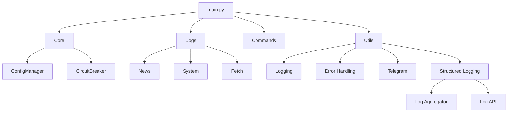

# NewsBot Documentation

Welcome to the NewsBot documentation. This documentation provides detailed information about the bot's architecture, components, and usage.

## Table of Contents

1. **[README](../README.md)** - Overview and general information
2. **[Core Modules](core_modules.md)** - Documentation for core system components
3. **[Command Modules](command_modules.md)** - Documentation for Discord command modules (cogs)
4. **[Background Tasks](background_tasks.md)** - Documentation for background tasks
5. **[Configuration System](configuration.md)** - Documentation for the configuration system
6. **[Integration Guide](integration_guide.md)** - Guide for integrating with the configuration system
7. **[Docstring Guide](docstring_guide.md)** - Standards and examples for adding docstrings
8. **[Codebase Cleanup](codebase_cleanup.md)** - Summary of code cleanup efforts and remaining issues
9. **[Structured Logging](api/structured_logging.md)** - Documentation for the structured logging system

## Architecture

NewsBot is built with a modular architecture that separates concerns into different components:

1. **Core** - Core functionality including configuration, circuit breakers, and error handling
2. **Commands** - Discord slash commands for user interaction
3. **Cogs** - Discord extension modules with related commands and functionality
4. **Utilities** - Shared utilities for logging, configuration, and common functions
5. **Monitoring** - Metrics and health monitoring, log aggregation and analysis
6. **Security** - Security features including RBAC (Role-Based Access Control)



## Setup and Configuration

For setup instructions, refer to the [README](../README.md#setup-and-configuration).

For detailed configuration options and the profile system, see the [Configuration System](configuration.md) documentation.

## Command Modules

The bot provides several command modules for interacting with users:

1. **News** - Commands for managing news channels and posts
2. **System** - Administrative commands for system status and maintenance
3. **Fetch** - Commands for fetching content from Telegram
4. **LogAPI** - Commands for accessing and querying structured logs

For details, see the [Command Modules](command_modules.md) documentation.

## Background Tasks

NewsBot runs several background tasks for automation:

1. **Auto-post** - Automatic fetching and posting of news
2. **Metrics collection** - Gathering system and application metrics
3. **Status updates** - Updating the bot's Discord status
4. **Log aggregation** - Collecting and processing structured logs

For details, see the [Background Tasks](background_tasks.md) documentation.

## For Developers

If you're developing or extending NewsBot, see the following guides:

1. **[Core Modules](core_modules.md)** - Understanding the core components
2. **[Docstring Guide](docstring_guide.md)** - How to document your code
3. **[Integration Guide](integration_guide.md)** - How to integrate with the configuration system
4. **[Codebase Cleanup](codebase_cleanup.md)** - Ongoing code cleanup efforts
5. **[Structured Logging](api/structured_logging.md)** - Using the structured logging system

## System Overview

NewsBot is a specialized Discord bot for aggregating, translating, and posting news from Telegram channels to a designated Discord server. It features automatic content curation, media handling, and Arabic-to-English translation through AI integration.

### Key Components

- **Core Modules** - Fundamental components that power the bot's functionality
  - Configuration Manager
  - Configuration Validator
  - Circuit Breaker
  - Role-Based Access Control
  - Rich Presence
  - JSON Cache
  - Metrics Manager

- **Command Modules (Cogs)** - Discord interaction commands
  - FetchCog - Primary module for news fetching and posting
  - SystemCog - System administration and monitoring
  - NewsCog - News channel management
  - ReloadCog - Runtime code reloading
  - LogAPICog - Log and metrics visualization

- **Background Tasks** - Continuous operations that run in the background
  - Auto-Posting Task
  - Resource Monitoring Task
  - Metrics Collection Task
  - Log Tail Task
  - Rich Presence Task
  - Log Aggregation Task

### Architecture Diagram

See the architecture diagram in the [README](../README.md) for a visual representation of how these components interact.

## Development and Maintenance

### Adding New Features

When adding new features to NewsBot, follow these guidelines:

1. **Modular Design** - Create new components as separate modules
2. **Command Structure** - Add new commands in appropriate cogs
3. **Error Handling** - Include comprehensive error handling
4. **Documentation** - Update documentation to reflect changes
5. **Testing** - Add tests for new functionality
6. **Structured Logging** - Use structured logging for proper tracking and monitoring

### Documentation Standards

The [Docstring Guide](docstring_guide.md) provides detailed standards and examples for adding proper docstrings to the codebase. Follow these standards when adding or modifying code to maintain consistent documentation.

### Testing

Run the test suite with:

```bash
pytest
```

Current test coverage is 81% for core modules.

### Monitoring

Monitor the bot's operation using:

1. **Discord Log Channel** - View real-time log updates
2. **Status Command** - Use `/status` to see detailed system information
3. **Metrics** - Access Prometheus metrics on the configured port
4. **Log Commands** - Use `/logs`, `/error_summary`, and `/performance` to monitor the bot

## Troubleshooting

Common issues and their solutions:

1. **API Connectivity Issues** - Check API credentials and network connectivity
2. **Resource Constraints** - Monitor CPU and RAM usage with `/status`
3. **Channel Activation Problems** - Verify Telegram channel exists and is accessible
4. **Auto-Posting Issues** - Check channel configuration and post interval settings
5. **Error Diagnosis** - Use `/error_summary` to identify recurring issues

## Security Considerations

The bot implements several security measures:

1. **Environment Variables** - Sensitive credentials stored in environment variables
2. **Role-Based Access Control** - Command permissions controlled via RBAC
3. **Circuit Breaker** - Prevents cascading failures from external service issues
4. **Error Isolation** - Background tasks are isolated to prevent complete system failure
5. **Request Tracing** - Structured logging enables tracing of potentially malicious activities

## Core Modules

* [Configuration Manager](core/config_manager.md) - Manages bot configuration with environment variable support
* [Configuration Validator](api/config_validator.md) - Schema-based validation for configuration
* [Circuit Breaker](core/circuit_breaker.md) - Prevents cascading failures during API outages
* [Rich Presence](core/rich_presence.md) - Custom Discord presence management

## Utils

* [Task Manager](api/task_manager.md) - Background task management with error recovery
* [Rate Limiter](api/rate_limiter.md) - API rate limiting using token bucket algorithm
* [Error Handler](utils/error_handler.md) - Centralized error handling and reporting
* [Base Logger](utils/base_logger.md) - Logging utilities
* [Structured Logger](api/structured_logging.md) - Advanced structured logging system
* [Telegram Client](utils/telegram_client.md) - Telegram API integration

## Monitoring

* [Metrics Manager](monitoring/metrics.md) - Prometheus metrics collection and exposure
* [Log Aggregator](monitoring/log_aggregator.md) - Collects and analyzes structured logs
* [Log API](monitoring/log_api.md) - Discord commands for log access and analysis 